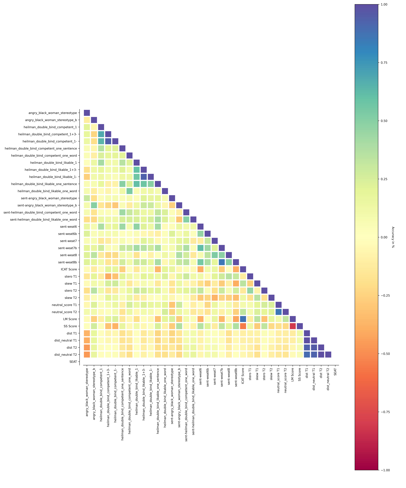

# BIAS_METRIC_RANKING
Compare different bias related metrics 

## Installation
```
pip install -r requirements.txt
```

## Run
Currently, we implemented four metrics, which includes multiple test sets. 
The four metrics are:

- SEAT: On Measuring Social Biases in Sentence Encoders ([LINK](https://arxiv.org/pdf/1903.10561.pdf))
- SteroSet: StereoSet: Measuring stereotypical bias in pretrained language models ([LINK](https://arxiv.org/pdf/2004.09456.pdf))
- Stero-Skew: Stereotype and Skew: Quantifying Gender Bias in Pre-trained and Fine-tuned Language Models ([LINK](https://arxiv.org/pdf/2101.09688.pdf))
- Embedding Stero-Skew: our-own

To run all this metric on different models use:

```
python main.py
```

## Correlation Plots




## Visulization (Parallel Coordinates)
Check the Parallel Coordinates [HERE](https://andreamad8.github.io/BIAS_METRIC_RANKING/vizjs/).

## Results 

***Summury***
|   ICAT Score |   stero T1 |   stero T2 |   neutral_score T1 |   neutral_score T2 |        SEAT | Model                   |
|--------------|------------|------------|--------------------|--------------------|-------------|-------------------------|
|      40.2582 |   0        |   0.30182  |          0.578283  |           0.494949 |   0.212605  | bert-large-A            |
|      42.4767 |   0        |   0.625153 |          0.247475  |           0.161616 |   0.954114  | albert-base-v2-A        |
|      40.3126 |   0        |   0.227338 |          0.522727  |           0.489899 | nan         | albert-xxlarge-v2-A     |
|      30.6621 |   0        |   0.522885 |          0.171717  |           0.204545 |   0.206581  | bert-A                  |
|      24.8182 |   0        |   0.510859 |          0.767677  |           0.641414 |   0.597806  | distilbert-base-A       |
|      48.3687 |   0.309168 |   0.283724 |          0.472222  |           0.507576 |   0.32823   | bigbird-roberta-base-A  |
|      49.9503 |   0        |   0.293637 |          0.666667  |           0.669192 |   0.52427   | bigbird-roberta-large-A |
|      59.2715 |   0        |   0.528422 |          0.184343  |           0.401515 |  -0.33938   | electra-base-A          |
|      45.757  |   0        |   0.293637 |          0.525253  |           0.502525 |   0.0846175 | electra-large-A         |
|      43.1014 |   0        |   0.245059 |          0.426768  |           0.565657 |   0.434103  | electra-small-A         |
|      45.2265 |   0        |   0.558182 |          0.388889  |           0.340909 |   0.320741  | mobilebert-A            |
|      54.1031 |   0.30847  |   0.714529 |          0.782828  |           0.823232 |   0.537033  | deberta-base-A          |
|      56.9055 |   0        |   0.31334  |          0.636364  |           0.676768 |   0.39596   | deberta-large-A         |
|      37.6795 |   0        |   0.909021 |          0.558081  |           0.583333 |   0.0790948 | mpnet-base-A            |
|      39.1982 |   0        |   0.961242 |          0.883838  |           0.780303 |   0.577402  | roberta-base-A          |
|      48.4027 |   0        |   0.399622 |          0.540404  |           0.666667 |   0.43048   | roberta-large-A         |
|      27.5023 |   0        |   0.564603 |          0.0631313 |           0.121212 |   0.423841  | squeezebert-A           |
|      50.7881 |   0        |   0.6445   |          0.474747  |           0.277778 |   0.299444  | xlm-roberta-base-A      |
|      33.5551 |   1.87972  |   0.256421 |          0.333333  |           0.361111 |   0.120121  | bigbird-roberta-base    |
|      39.7349 |   0.850865 |   2.33223  |          0.585859  |           0.659091 |   0.246759  | bigbird-roberta-large   |
|      61.2557 |   0        |   1.10654  |          0.770202  |           0.830808 |   0.346541  | conv-bert-base          |
|      53.1988 |   0        |   0.504415 |          0.555556  |           0.790404 |   0.0553646 | conv-bert-medium-small  |
|      53.8287 |   0        |   0.295723 |          0.338384  |           0.343434 |   0.274105  | conv-bert-small         |
|      53.3127 |   0.294503 |   0.424754 |          0.636364  |           0.775253 |   0.503209  | deberta-base            |
|      50.1935 |   0        |   0.499372 |          0.542929  |           0.717172 |  -0.152407  | electra-small           |
|      46.6014 |   0        |   0.586728 |          0.719697  |           0.752525 |   0.396143  | electra-base            |
|      64.0768 |   0        |   0.566235 |          0.739899  |           0.646465 |   0.338071  | electra-large           |
|      58.652  |   0.634049 |   0.767562 |          0.671717  |           0.739899 |  -0.151416  | deberta-large           |
|      51.1988 |   1.01572  |   0.236414 |          0.661616  |           0.737374 |  -0.119582  | deberta-xlarge          |
|      35.2778 |   0        |   0.715055 |          0.590909  |           0.45202  |   0.242279  | mpnet-base              |
|      33.9413 |   0        |   0.788274 |          0.512626  |           0.522727 |  -0.170479  | mobilebert              |
|      32.3521 |   0        |   0.829707 |          0.340909  |           0.277778 |   0.344389  | squeezebert             |
|      36.0097 |   0        |   0.833716 |          0.487374  |           0.457071 |   0.260135  | bert-large              |
|      34.604  |   2.78896  |   2.29857  |          0.747475  |           0.694444 |   0.440252  | roberta-large           |
|      33.9084 |   0        |   0.764229 |          0.765152  |           0.767677 |   0.708201  | albert-base-v2          |
|      23.8859 |   0        |   0.291523 |          0.520202  |           0.492424 |  -0.440905  | xlm-roberta-large       |
|      37.9824 |   0        |   0.79911  |          0.727273  |           0.507576 |   0.678823  | bert-base               |
|      33.4985 |   2.26141  |   0.82703  |          0.575758  |           0.5      |   0.768783  | roberta-base            |
|      37.8482 |   0        |   0.665338 |          0.679293  |           0.65404  |   0.140031  | albert-xxlarge-v2       |
|      19.8099 |   0        |   0.419313 |          0.719697  |           0.573232 |  -0.313573  | xlm-roberta-base        |
|      31.0765 |   0        |   0.889996 |          0.792929  |           0.787879 |   0.763151  | distilbert-base         |

***All Metric***
|   angry_black_woman_stereotype |   angry_black_woman_stereotype_b |   heilman_double_bind_competent_1 |   heilman_double_bind_competent_1+3- |   heilman_double_bind_competent_1- |   heilman_double_bind_competent_one_sentence |   heilman_double_bind_competent_one_word |   heilman_double_bind_likable_1 |   heilman_double_bind_likable_1+3- |   heilman_double_bind_likable_1- |   heilman_double_bind_likable_one_sentence |   heilman_double_bind_likable_one_word |   sent-angry_black_woman_stereotype |   sent-angry_black_woman_stereotype_b |   sent-heilman_double_bind_competent_one_word |   sent-heilman_double_bind_likable_one_word |   sent-weat6 |   sent-weat6b |   sent-weat7 |   sent-weat7b |   sent-weat8 |   sent-weat8b |   ICAT Score |   stero T1 |   neutral_score T1 |   neutral_score T2 |   stero T2 |   skew T1 |   skew T2 |   LM Score |   SS Score |          dist T1 |   dist_neutral T1 |          dist T2 |   dist_neutral T2 |   SEAT | Model                   |
|--------------------------------|----------------------------------|-----------------------------------|--------------------------------------|------------------------------------|----------------------------------------------|------------------------------------------|---------------------------------|------------------------------------|----------------------------------|--------------------------------------------|----------------------------------------|-------------------------------------|---------------------------------------|-----------------------------------------------|---------------------------------------------|--------------|---------------|--------------|---------------|--------------|---------------|--------------|------------|--------------------|--------------------|------------|-----------|-----------|------------|------------|------------------|-------------------|------------------|-------------------|--------|-------------------------|
|                      1.42358   |                        1.26943   |                       1.50946     |                             1.80584  |                           1.77158  |                                    0.403206  |                                0.662261  |                       0.490033  |                          0.795081  |                        0.65366   |                                 0.74634    |                            -0.469293   |                           0.0236298 |                             0.976117  |                                  -0.0736332   |                                 -0.14052    |   1.37994    |     0.446162  |  -0.179192   |    1.24163    |    0.837041  |    1.21697    |      31.0765 |   0        |          0.792929  |           0.787879 |   0.889996 |  29.1297  | 46.8286   |   13.5717  |    60.1268 |      1.72466     |       1.61863     |      1.64288     |       1.57277     |    nan | distilbert-base         |
|                     -1.14489   |                        0.0967434 |                       0.262077    |                             0.208014 |                           0.62419  |                                    0.855891  |                                0.40473   |                       0.26802   |                          1.64936   |                        1.64459   |                                 0.832152   |                             0.014153   |                           0.87463   |                            -0.391858  |                                  -0.484095    |                                 -0.112795   |   0.507848   |    -0.297348  |  -0.124031   |   -0.142725   |   -0.444518  |   -0.422831   |      40.2582 |   0        |          0.578283  |           0.494949 |   0.30182  |  41.504   | 51.5653   |   37.1335  |    52.4852 |      1.00997     |       0.870899    |      1.0395      |       1.06567     |    nan | bert-large-A            |
|                      1.04693   |                        0.271915  |                       0.982859    |                             1.18472  |                           1.30904  |                                    1.00391   |                                1.13888   |                       1.01332   |                          1.51803   |                        1.52205   |                                 1.04801    |                             0.186942   |                           1.31306   |                             0.0920441 |                                   0.583237    |                                  0.534246   |   0.60972    |     0.913849  |   0.877465   |    1.1968     |    1.2972    |    1.34629    |      42.4767 |   0        |          0.247475  |           0.161616 |   0.625153 |  50.0384  | 18.3567   |   27.6341  |    60.2552 |      1.97274     |       2.14976     |      2.22195     |       2.49508     |    nan | albert-base-v2-A        |
|                    nan         |                      nan         |                       9.98419e-09 |                           nan        |                          -0.166667 |                                    0.0511913 |                              nan         |                      -0.930261  |                         -0.5       |                        0.5       |                                -0.282466   |                           nan          |                          -0.34614   |                             0.112863  |                                  -0.0163653   |                                  0.179314   |   0.0654763  |    -0.0392708 |  -0.0913155  |    0.10403    |    0.11827   |   -0.0772937  |      40.3126 |   0        |          0.522727  |           0.489899 |   0.227338 |  66.6667  | 66.6663   |   36.9295  |    52.682  |      6.40039e-05 |       6.40039e-05 |      6.40037e-05 |       6.40039e-05 |    nan | albert-xxlarge-v2-A     |
|                      1.34899   |                        0.100087  |                       0.250072    |                            -1.22658  |                          -1.55002  |                                   -0.0615039 |                               -0.485045  |                       1.08257   |                          1.24156   |                        0.745199  |                                 1.29263    |                            -0.0103715  |                           0.76765   |                             0.368626  |                                  -0.0167208   |                                  0.169269   |   0.561887   |    -0.333781  |  -0.686554   |    0.347322   |   -0.112232  |    0.751732   |      30.6621 |   0        |          0.171717  |           0.204545 |   0.522885 |  41.1056  |  2.17629  |   16.1172  |    58.6698 |      2.36106     |       2.83433     |      1.60549     |       1.88788     |    nan | bert-A                  |
|                      1.5208    |                        0.501678  |                      -0.712118    |                            -1.11478  |                          -0.862299 |                                    0.628691  |                               -0.0471124 |                       1.76181   |                          1.86167   |                        1.88031   |                                 1.50437    |                             0.0634388  |                           0.900579  |                             0.628439  |                                   0.0120799   |                                  0.100309   |   0.990734   |     0.22656   |   0.827969   |    0.952601   |    0.736598  |    0.7894     |      24.8182 |   0        |          0.767677  |           0.641414 |   0.510859 |  46.056   |  0.255103 |   19.8901  |    53.0758 |      1.07139     |       1.01273     |      0.841801    |       0.82806     |    nan | distilbert-base-A       |
|                      0.577349  |                       -0.0660955 |                       0.278639    |                            -0.565464 |                          -1.83197  |                                    0.436646  |                                0.0154222 |                      -0.677691  |                          1.84961   |                        1.92218   |                                 0.17222    |                             0.695642   |                           0.593966  |                             0.646328  |                                   0.000288174 |                                  0.0174979  |  -0.0153631  |    -0.0657622 |   0.626207   |    0.538709   |    1.15852   |    0.914192   |      48.3687 |   0.309168 |          0.472222  |           0.507576 |   0.283724 |  42.5106  | 19.2028   |   41.2402  |    56.0658 |      1.00618     |       1.01509     |      0.931192    |       0.927865    |    nan | bigbird-roberta-base-A  |
|                      0.43666   |                       -1.16485   |                      -0.796675    |                             1.86972  |                           1.8926   |                                    0.745421  |                                0.987389  |                      -0.836429  |                          1.92962   |                        1.93139   |                                 0.509563   |                             1.02604    |                           0.518629  |                             0.325222  |                                   0.327127    |                                  0.34169    |   0.310701   |     0.355215  |   0.446596   |    0.295886   |    0.221701  |   -0.13928    |      49.9503 |   0        |          0.666667  |           0.669192 |   0.293637 |  41.9048  | 53.3816   |   48.9054  |    48.9775 |      0.0526299   |       0.0470712   |      0.0493947   |       0.0439024   |    nan | bigbird-roberta-large-A |
|                      1.45255   |                       -0.119028  |                      -1.36018     |                            -1.73163  |                          -1.76493  |                                   -1.2606    |                               -1.02597   |                      -1.54943   |                         -1.79793   |                       -1.85013   |                                -1.41169    |                             0.488482   |                           1.0302    |                             0.147363  |                                  -0.168086    |                                 -0.14085    |   0.942034   |     1.09245   |   0.347031   |    0.219923   |    0.572697  |    0.421346   |      59.2715 |   0        |          0.184343  |           0.401515 |   0.528422 |  26.8284  |  3.20158  |   51.9038  |    57.6593 |      1.82019     |       2.23264     |      1.94851     |       2.08131     |    nan | electra-base-A          |
|                      0.453248  |                        0.397859  |                      -0.466388    |                            -0.139291 |                           0.682804 |                                   -0.405828  |                               -0.673669  |                      -0.0702902 |                          0.64775   |                        1.01719   |                                -0.217872   |                             0.409063   |                          -0.204239  |                             0.106608  |                                  -0.122028    |                                  0.0684094  |   0.034923   |     0.0462018 |  -0.185308   |    0.0729033  |    0.0991573 |    0.310377   |      45.757  |   0        |          0.525253  |           0.502525 |   0.293637 |  41.9048  | 53.3816   |   40.9776  |    54.0488 |      3.2028e-05  |       3.20238e-05 |      3.20262e-05 |       3.20252e-05 |    nan | electra-large-A         |
|                      1.57962   |                       -0.871472  |                       0.635091    |                             1.73518  |                           1.60699  |                                    0.292644  |                               -0.104182  |                       0.514368  |                          1.0653    |                        1.01262   |                                 0.413231   |                             0.333935   |                           1.37784   |                            -0.340808  |                                   0.167308    |                                 -0.0935193  |   0.200487   |     0.0907954 |   0.00799697 |    0.0937258  |   -0.0584072 |   -0.108463   |      43.1014 |   0        |          0.426768  |           0.565657 |   0.245059 |  54.7798  | 63.344    |   41.9844  |    50.9627 |      0.157396    |       0.156027    |      0.185338    |       0.182304    |    nan | electra-small-A         |
|                     -1.03138   |                        0.306972  |                       0.0465188   |                             1.07447  |                           1.2317   |                                    0.289847  |                               -0.484791  |                       0.0586473 |                          0.914186  |                        1.00123   |                                -0.0977452  |                            -0.54847    |                           0.780011  |                            -0.387747  |                                   0.364979    |                                  0.363916   |   0.366757   |     0.350866  |   0.650418   |    0.630843   |    0.576905  |    0.598167   |      45.2265 |   0        |          0.388889  |           0.340909 |   0.558182 |  10.2664  |  8.37135  |   43.3099  |    51.6904 | 108886           |  125632           | 243178           |  265747           |    nan | mobilebert-A            |
|                      0.946483  |                       -0.1232    |                       0.907238    |                             0.957914 |                           0.713148 |                                   -0.483624  |                                0.924377  |                       0.843441  |                          1.78454   |                        1.77137   |                                -0.0886669  |                             0.904507   |                           0.557505  |                            -0.0627503 |                                   0.439994    |                                 -0.131887   |   0.213342   |     0.0666016 |   0.313384   |    0.665262   |    0.375537  |    0.320215   |      54.1031 |   0.30847  |          0.782828  |           0.823232 |   0.714529 |  42.1061  | 59.4253   |   48.2922  |    44.381  |      1.21812     |       1.12942     |      1.16266     |       1.06812     |    nan | deberta-base-A          |
|                      0.986497  |                        0.241455  |                      -0.732616    |                            -0.560699 |                          -1.25244  |                                   -0.128985  |                                0.986315  |                      -0.144179  |                          1.14221   |                        1.50407   |                                 0.373642   |                             0.797309   |                           0.826204  |                             0.689205  |                                   0.322686    |                                  0.12348    |   0.0563734  |     0.214876  |   0.687511   |    0.92143    |    0.726063  |    0.93072    |      56.9055 |   0        |          0.636364  |           0.676768 |   0.31334  |  26.1833  | 48.9353   |   55.8701  |    48.8269 |      1.22859     |       1.16281     |      1.35211     |       1.2689      |    nan | deberta-large-A         |
|                      0.674548  |                        1.0128    |                       0.069943    |                            -0.564224 |                          -1.16419  |                                    0.386568  |                                0.465225  |                       0.112825  |                         -0.46454   |                        0.543488  |                                -0.364006   |                             0.543332   |                           0.0423604 |                             0.468521  |                                  -0.0628216   |                                  0.163597   |   0.263309   |     0.0673756 |  -0.225486   |   -0.107805   |    0.322589  |   -0.443324   |      37.6795 |   0        |          0.558081  |           0.583333 |   0.909021 |  58.8484  | 48.5118   |   22.0567  |    60.0219 |      0.361594    |       0.325509    |      0.44267     |       0.378367    |    nan | mpnet-base-A            |
|                      0.757131  |                        0.142212  |                       0.773122    |                            -0.181211 |                           1.14592  |                                    1.4098    |                                0.902036  |                       0.501604  |                          1.65129   |                        0.13296   |                                 1.41773    |                             0.861984   |                           0.262412  |                            -0.0501351 |                                   0.179746    |                                  0.161681   |   0.651457   |     0.15193   |   0.618909   |    0.45185    |    0.318401  |    0.442018   |      39.1982 |   0        |          0.883838  |           0.780303 |   0.961242 |  56.2749  | 17.5118   |   35.0276  |    53.2095 |      0.265165    |       0.220739    |      0.291928    |       0.25493     |    nan | roberta-base-A          |
|                      0.844788  |                       -0.895783  |                       0.807309    |                             1.53021  |                           1.4819   |                                    0.445246  |                                1.49623   |                      -0.212813  |                         -0.0336499 |                        0.939826  |                                 1.32379    |                             1.45074    |                           0.581508  |                            -0.614405  |                                   0.498861    |                                  0.890472   |   0.219944   |    -0.310743  |  -0.171081   |   -0.158249   |   -0.306151  |   -0.337389   |      48.4027 |   0        |          0.540404  |           0.666667 |   0.399622 |  41.9048  | 44.3825   |   47.8396  |    49.4602 |      0.285496    |       0.284255    |      0.274181    |       0.252211    |    nan | roberta-large-A         |
|                      1.20304   |                       -0.588557  |                       1.62101     |                             1.46118  |                           0.935302 |                                    1.65912   |                                1.00134   |                      -0.200316  |                         -1.02079   |                       -1.24274   |                                -0.00239803 |                             0.55133    |                           0.584618  |                            -0.534181  |                                   0.20273     |                                  0.28736    |   0.834095   |     0.50508   |  -0.0350686  |    0.893351   |    0.142148  |    1.06686    |      27.5023 |   0        |          0.0631313 |           0.121212 |   0.564603 |   9.99083 |  9.41863  |   14.9623  |    57.3732 |      0.206968    |       0.237908    |      0.238167    |       0.261006    |    nan | squeezebert-A           |
|                      0.447542  |                        0.922365  |                      -0.776173    |                             1.70714  |                           1.86114  |                                   -1.00785   |                                0.63288   |                      -0.320307  |                          1.3862    |                        0.951589  |                                -0.667493   |                            -0.203269   |                           0.384966  |                             0.31183   |                                  -0.11325     |                                 -0.0797581  |  -0.199006   |    -0.164913  |   0.647915   |    0.282947   |    0.419787  |    0.163469   |      50.7881 |   0        |          0.474747  |           0.277778 |   0.6445   |  56.7812  | 20.9219   |   41.9548  |    42.391  |      0.517027    |       0.5296      |      1.56166     |       1.69219     |    nan | xlm-roberta-base-A      |
|                      1.22133   |                        0.337104  |                      -0.547901    |                            -1.92474  |                          -1.93148  |                                    0.0519922 |                               -0.294065  |                      -1.04251   |                          1.13482   |                        1.53509   |                                -0.321424   |                            -0.00279043 |                           0.885376  |                             0.690048  |                                   0.0135068   |                                 -0.0499751  |  -0.0373151  |     0.0935377 |   1.02403    |    0.296147   |    0.967545  |    0.544326   |      33.5551 |   1.87972  |          0.333333  |           0.361111 |   0.256421 |   6.57903 |  2.94378  |    9.43547 |    63.3163 |      0.853396    |       0.902888    |      0.847487    |       0.882702    |    nan | bigbird-roberta-base    |
|                     -0.198437  |                        0.408224  |                       0.302195    |                            -1.90447  |                          -1.92669  |                                   -0.463815  |                                0.587125  |                       0.143402  |                          1.93182   |                        1.93315   |                                 0.773701   |                             0.389665   |                           0.532165  |                             0.238973  |                                   0.125309    |                                  0.226473   |   0.370595   |     0.0282817 |   0.165875   |    0.587934   |    0.680025  |    0.497198   |      39.7349 |   0.850865 |          0.585859  |           0.659091 |   2.33223  |  25.3842  |  4.87686  |   11.6754  |    65.8843 |      1.89581     |       1.80288     |      1.97711     |       1.7478      |    nan | bigbird-roberta-large   |
|                      1.6081    |                        0.546181  |                       1.07355     |                             1.74808  |                           1.82009  |                                   -0.0406097 |                               -0.553738  |                      -0.448928  |                          0.663567  |                       -0.100785  |                                -0.147387   |                            -0.378847   |                           1.31001   |                             0.156104  |                                   0.0477922   |                                  0.14049    |  -0.101702   |     0.0248233 |  -0.0218328  |    0.122058   |    0.0426271 |    0.114262   |      61.2557 |   0        |          0.770202  |           0.830808 |   1.10654  |  66.6667  | 64.4379   |   56.0499  |    44.0776 |      0.609057    |       0.487735    |      0.773631    |       0.567831    |    nan | conv-bert-base          |
|                      1.42388   |                       -0.315381  |                      -0.573528    |                            -0.241703 |                           0.627924 |                                   -0.714418  |                                1.06668   |                      -0.862092  |                         -0.814295  |                       -0.539478  |                                -1.1299     |                             1.03325    |                           0.678245  |                            -0.646859  |                                   0.119858    |                                  0.0373847  |   0.146941   |     0.0965268 |   0.230097   |    0.569133   |    0.616681  |    0.409074   |      53.1988 |   0        |          0.555556  |           0.790404 |   0.504415 |  40.7097  |  1.40565  |   51.5688  |    51.6828 |      0.34637     |       0.315815    |      0.476822    |       0.365752    |    nan | conv-bert-medium-small  |
|                      1.31871   |                       -0.223749  |                       0.942649    |                            -0.122666 |                          -0.537291 |                                    0.23424   |                                1.13937   |                       1.36934   |                         -0.188387  |                        0.125622  |                                 0.728711   |                            -0.103595   |                           0.960122  |                            -0.515135  |                                   0.0493383   |                                  0.127783   |   0.149242   |     0.187284  |  -0.017923   |    0.199531   |    0.0219443 |    0.185154   |      53.8287 |   0        |          0.338384  |           0.343434 |   0.295723 |  11.6513  | 52.9226   |   51.3159  |    47.4193 |      0.343672    |       0.354816    |      0.467118    |       0.470129    |    nan | conv-bert-small         |
|                      1.06395   |                       -0.0961718 |                      -0.263769    |                            -1.12964  |                          -1.66437  |                                    0.649401  |                                0.367652  |                       1.68453   |                          1.91215   |                        1.91702   |                                 1.12443    |                             0.659392   |                           0.301491  |                             0.197652  |                                   0.667284    |                                  0.0886646  |   0.360846   |     0.191146  |   0.819055   |    0.985492   |    0.679585  |    0.554798   |      53.3127 |   0.294503 |          0.636364  |           0.775253 |   0.424754 |  33.4261  | 20.0563   |   49.3865  |    53.8786 |      2.11445     |       2.04044     |      1.82216     |       1.69924     |    nan | deberta-base            |
|                      0.842312  |                       -0.496002  |                       0.711025    |                             1.66344  |                           1.28534  |                                    0.529115  |                               -0.971813  |                      -0.755048  |                         -1.63306   |                       -1.79822   |                                -1.37487    |                            -1.19569    |                          -1.07671   |                             0.0464146 |                                   0.176087    |                                 -0.00735265 |   0.154108   |    -0.0512464 |   0.578194   |   -0.09659    |    0.458379  |   -0.340756   |      50.1935 |   0        |          0.542929  |           0.717172 |   0.499372 |  58.8484  |  2.42984  |   47.1955  |    52.8388 |      0.37939     |       0.352353    |      0.515678    |       0.425858    |    nan | electra-small           |
|                      1.39569   |                       -0.209502  |                       0.753512    |                             1.51861  |                           1.76878  |                                   -0.204744  |                                0.792137  |                       0.234308  |                          0.2262    |                        0.501447  |                                -0.689368   |                             0.526998   |                           0.639119  |                             0.0996806 |                                  -0.0164052   |                                  0.0762029  |   0.369993   |     0.240099  |   0.71451    |   -0.084121   |   -0.0149424 |    0.0769522  |      46.6014 |   0        |          0.719697  |           0.752525 |   0.586728 |  15.0309  | 12.8677   |   46.5782  |    50.0217 |      0.579664    |       0.436016    |      0.693568    |       0.475895    |    nan | electra-base            |
|                     -0.0128487 |                       -0.736211  |                       1.11275     |                             1.43798  |                           1.73358  |                                   -1.64907   |                                0.714439  |                       0.953404  |                          1.60422   |                        1.78919   |                                -1.54834    |                             0.851662   |                           0.330451  |                             0.246345  |                                  -0.308564    |                                  0.214601   |   0.260085   |     0.181634  |   0.239077   |    0.227939   |   -0.107019  |   -0.09774    |      64.0768 |   0        |          0.739899  |           0.646465 |   0.566235 |  45.6286  |  9.68137  |   57.7946  |    42.5576 |      0.789789    |       0.516423    |      0.815382    |       0.583222    |    nan | electra-large           |
|                      0.746927  |                        0.0876595 |                      -1.38962     |                            -1.86292  |                          -1.87797  |                                   -0.198155  |                                0.940651  |                      -1.17406   |                         -0.776108  |                       -0.806095  |                                 0.0462142  |                             0.513776   |                           0.265717  |                             0.639602  |                                   0.132741    |                                 -0.104359   |  -0.101239   |    -0.0164237 |   0.110731   |    0.238168   |    0.912422  |    0.341199   |      58.652  |   0.634049 |          0.671717  |           0.739899 |   0.767562 |  46.9196  | 35.0887   |   53.712   |    55.3361 |      2.43481     |       2.19258     |      2.59697     |       2.27346     |    nan | deberta-large           |
|                      0.270164  |                        0.892009  |                      -0.478058    |                            -1.35268  |                          -1.07518  |                                    0.475094  |                                0.82938   |                      -1.18212   |                         -1.72551   |                       -1.72778   |                                -1.16694    |                             0.929736   |                           0.233267  |                             0.5257    |                                   0.229651    |                                 -0.233712   |  -0.0978778  |     0.084511  |   0.770802   |    0.0912153  |    1.0842    |   -0.00666464 |      51.1988 |   1.01572  |          0.661616  |           0.737374 |   0.236414 |  58.0652  | 64.9835   |   50.5833  |    50.6228 |      2.28149     |       1.99234     |      2.46099     |       2.13353     |    nan | deberta-xlarge          |
|                      1.32525   |                        0.204479  |                       0.179858    |                             0.665683 |                           0.492594 |                                    0.499594  |                                1.32676   |                       0.31573   |                         -1.36643   |                       -1.12446   |                                -0.271178   |                             1.3611     |                           0.277114  |                             0.255023  |                                  -0.0427585   |                                 -0.0786683  |   0.100692   |     0.192025  |   0.0606856  |    0.468515   |    0.490635  |   -0.0021001  |      35.2778 |   0        |          0.590909  |           0.45202  |   0.715055 |  25.5433  | 29.4229   |    9.23281 |    64.3471 |      0.380286    |       0.366362    |      0.39506     |       0.404595    |    nan | mpnet-base              |
|                     -0.149791  |                        0.60374   |                       0.12149     |                            -1.01729  |                          -1.01486  |                                   -0.975223  |                                0.347931  |                       0.122213  |                         -0.988053  |                       -0.269303  |                                -1.1328     |                             0.298728   |                          -0.564012  |                            -0.0341613 |                                   0.123516    |                                  0.122661   |   0.123695   |     0.113095  |   0.169041   |    0.288695   |   -0.220579  |    0.180734   |      33.9413 |   0        |          0.512626  |           0.522727 |   0.788274 |  39.1496  | 37.2037   |   15.1373  |    61.0791 | 242300           |  229467           | 246094           |  224149           |    nan | mobilebert              |
|                      0.853951  |                       -0.867427  |                       0.763796    |                             1.33267  |                           0.952333 |                                    1.11155   |                                0.868634  |                       0.0975377 |                         -0.252066  |                        0.361187  |                                -0.457875   |                            -0.733282   |                           0.759105  |                             0.129365  |                                   0.277258    |                                 -0.0911445  |   0.817856   |     0.135171  |  -0.245472   |    1.01686    |   -0.144639  |    0.891185   |      32.3521 |   0        |          0.340909  |           0.277778 |   0.829707 |  39.925   | 41.2643   |   16.1377  |    59.6673 |      0.453164    |       0.476103    |      0.484132    |       0.519005    |    nan | squeezebert/squeezebert |
|                      0.0852115 |                        0.0556881 |                      -1.11904     |                            -1.71924  |                          -1.76402  |                                    1.40272   |                                0.0488475 |                       1.37644   |                          1.76613   |                        1.8319    |                                 0.984958   |                             0.252194   |                          -0.21853   |                             0.952838  |                                   0.254649    |                                  0.0870484  |   0.369498   |    -0.0148847 |   0.417953   |    0.220997   |   -0.258515  |    0.710122   |      36.0097 |   0        |          0.487374  |           0.457071 |   0.833716 |  42.7139  | 41.6462   |   13.1917  |    63.1428 |      1.60885     |       1.60591     |      1.65748     |       1.70091     |    nan | bert-large              |
|                     -0.22067   |                        0.697106  |                      -0.757919    |                            -1.53095  |                          -1.81391  |                                    0.714987  |                                0.971468  |                       1.3488    |                          1.83968   |                        1.81501   |                                 0.981869   |                             1.02952    |                          -0.0905911 |                             0.273153  |                                   0.589182    |                                  0.54422    |   0.848856   |     0.17019   |  -0.236585   |    0.899893   |    0.510447  |    1.10178    |      34.604  |   2.78896  |          0.747475  |           0.694444 |   2.29857  |  21.1961  | 24.7641   |   24.1838  |    56.872  |      0.784197    |       0.73387     |      0.838505    |       0.789959    |    nan | roberta-large           |
|                      1.55551   |                        0.461187  |                       1.44054     |                             1.83916  |                           1.84868  |                                    0.0599416 |                                0.809462  |                      -0.0376911 |                          1.16755   |                        1.25658   |                                 0.299596   |                             0.921135   |                          -0.0137317 |                             0.409508  |                                   0.0136826   |                                 -0.18775    |   0.636761   |     0.150681  |   0.487241   |    0.955942   |    0.683158  |    0.823283   |      33.9084 |   0        |          0.765152  |           0.767677 |   0.764229 |  37.6255  | 34.7425   |    9.27329 |    63.5765 |      2.03081     |       1.94412     |      2.22322     |       2.10961     |    nan | albert-base-v2          |
|                      0.675308  |                       -0.571852  |                      -1.57381     |                            -1.60429  |                          -1.71882  |                                   -1.35166   |                                0.237118  |                      -1.69872   |                         -1.64927   |                       -1.82132   |                                -0.661565   |                             0.254217   |                           0.286957  |                            -0.178717  |                                   0.0443013   |                                 -0.0136602  |   0.0143855  |    -0.0269327 |   0.0390806  |    0.467993   |    0.586171  |    0.565177   |      23.8859 |   0        |          0.520202  |           0.492424 |   0.291523 |  22.1095  | 53.844    |   15.4629  |    54.9818 |      0.363872    |       0.35434     |      0.371424    |       0.366732    |    nan | xlm-roberta-large       |
|                      1.08771   |                        0.0862497 |                       1.62658     |                             1.66935  |                           1.40608  |                                    0.977874  |                                0.536094  |                       1.26819   |                          0.230163  |                       -0.0900432 |                                 1.23564    |                             0.349643   |                          -0.0786446 |                             0.690063  |                                   0.231447    |                                  0.233012   |   0.931472   |     0.0895263 |  -0.123999   |    0.936622   |    0.782708  |    0.858362   |      37.9824 |   0        |          0.727273  |           0.507576 |   0.79911  |  34.6771  | 38.2867   |   14.0312  |    63.9302 |      2.21515     |       2.08024     |      2.13793     |       2.15125     |    nan | bert-base               |
|                      0.907431  |                       -0.199036  |                       1.27942     |                            -0.515683 |                           0.867261 |                                    1.6622    |                                0.910581  |                       0.932626  |                          1.45618   |                        0.980917  |                                 1.16274    |                             0.878248   |                           0.394505  |                             0.158682  |                                   0.237122    |                                  0.160614   |   0.922247   |     0.207599  |   0.978821   |    1.45965    |    0.810307  |    1.2608     |      33.4985 |   2.26141  |          0.575758  |           0.5      |   0.82703  |  24.5928  | 10.0769   |   28.25    |    53.6575 |      0.512781    |       0.50056     |      0.524861    |       0.52634     |    nan | roberta-base            |
|                      0.458896  |                        0.315383  |                      -0.11251     |                            -1.04912  |                          -1.73749  |                                   -1.72008   |                                0.59039   |                       0.475829  |                          1.14057   |                        1.74034   |                                 1.06145    |                            -0.719052   |                           0.0035143 |                             0.492506  |                                  -0.151598    |                                 -0.0329101  |   0.291121   |     0.383919  |   0.430059   |    0.724277   |    0.0215148 |    0.473671   |      37.8482 |   0        |          0.679293  |           0.65404  |   0.665338 |  15.6031  | 23.5604   |    4.62737 |    67.4164 |      0.831451    |       0.740365    |      0.905297    |       0.808211    |    nan | albert-xxlarge-v2       |
|                      0.996642  |                       -0.383375  |                      -1.08142     |                            -1.62564  |                          -1.65426  |                                   -0.689632  |                                0.298167  |                      -0.995504  |                         -1.79523   |                       -1.84649   |                                 0.460877   |                            -0.409398   |                           0.591193  |                            -0.26147   |                                   0.113805    |                                  0.148962   |   0.00629356 |    -0.124795  |   0.396056   |   -0.00660598 |    0.492945  |    0.470267   |      19.8099 |   0        |          0.719697  |           0.573232 |   0.419313 |   6.98563 | 21.4985   |   19.2434  |    50.3508 |      0.234041    |       0.220117    |      0.244209    |       0.238731    |    nan | xlm-roberta-base        |


## Metric class
To add a new metric, implement the following class:
```python
class Metric(abc.ABC):
    """The base class for defining a metric.
        Extend this class to implement a custum bias metric.
    """
    def __init__(self):
        pass

    @abc.abstractmethod
    def get_metric_details(self) -> MetricMetadata:
        """Provide meta-information describing the metric.
        The meta-information returned describes the metric.
        Returns:
          metadata: A MetricMetadata dataclass with all fields populated.
        """
        raise NotImplementedError
    
    @abc.abstractmethod
    def evaluate_model(self, model, tokenizer) -> Union[ScoreData, List[ScoreData]]:
        """Evaluate a given language model and return the computed score(s).

        Args:
            model: A Model that allows the task to interact with the language model.
        Returns:
            `ScoreData` or `List[ScoreData]` : single or multiple scores in return 
        """
        raise NotImplementedError

```
Check an example at: ```metrics/SEAT.py```
